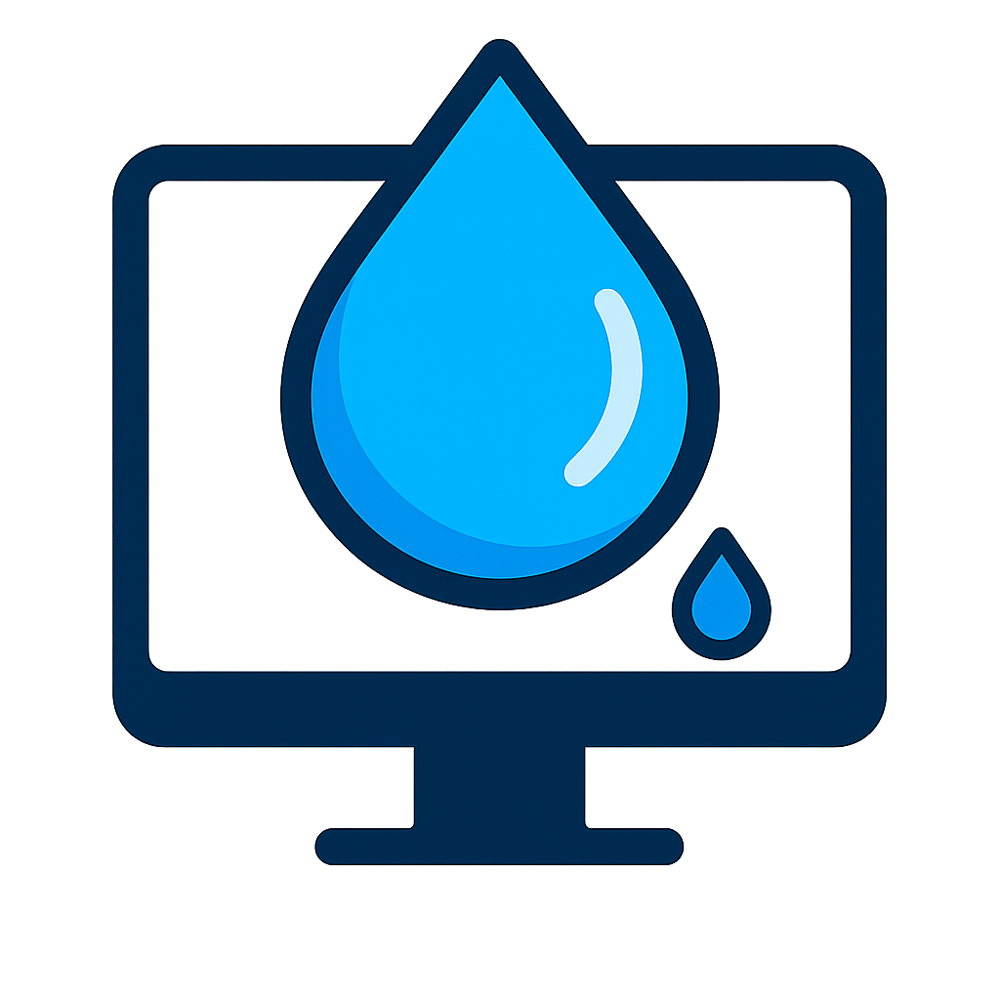

# 🚀 Techoxium

<div align="center">
  
  
  **Teknolojinin Elementi - Modern Türkçe Teknoloji Blogu**
  
  
  
  
  

  [🌐 Canlı Site](https://techoxium.com) • [📝 Blog Yazıları](https://techoxium.com/blog) • [🔖 Etiketler](https://techoxium.com/tag/technology)

</div>

---

## ✨ Özellikler

🔍 **Akıllı Arama** - Gerçek zamanlı blog yazısı arama
📱 **Responsive Design** - Mobil-first yaklaşım
🌙 **Dark/Light Theme** - Sistem tercihini takip eder
⚡ **Lightning Fast** - Edge'de SSR ile ultra hızlı
🎨 **Modern UI/UX** - Minimalist ve kullanıcı dostu
🇹🇷 **Türkçe İçerik** - Tamamen Türkçe teknoloji blogu
� **SEO Optimized** - Sitemap, meta tags, structured data
📊 **Analytics Ready** - Production analytics desteği

## 🛠️ Tech Stack

| Kategori | Teknoloji |
|----------|-----------|
| **Framework** | Astro 5.13.3 (SSR) |
| **Adapter** | Cloudflare Workers |
| **Styling** | Modern CSS + CSS Variables |
| **Content** | Markdoc (.mdoc files) |
| **Search** | Client-side JavaScript |
| **Images** | Sharp (optimization) |
| **Deploy** | Wrangler CLI |

## � Hızlı Başlangıç

### Geliştirme

```bash
# Projeyi klonla
git clone https://github.com/denizomer1/techoxium.git
cd techoxium

# Bağımlılıkları yükle
npm install

# Development server'ı başlat
npm run dev
# 🌐 http://localhost:4321
```

### Production Build

```bash
# Static build (development)
npm run build

# Cloudflare Workers build
npm run build:cloudflare

# Local preview (Wrangler)
npm run preview
```

### Deploy

```bash
# Cloudflare'ye deploy et
npm run deploy

# Dry run (test)
npx wrangler deploy --dry-run
```

## 📁 Proje Yapısı

```
techoxium/
├── 📄 astro.config.mjs      # Astro konfigürasyonu
├── 📄 wrangler.toml         # Cloudflare Workers config
├── 📁 src/
│   ├── 📁 components/       # Astro components
│   ├── 📁 content/          # Blog yazıları (.mdoc)
│   ├── 📁 layouts/          # Page layouts
│   ├── 📁 pages/            # Route pages
│   ├── 📁 styles/           # Global CSS
│   └── 📁 lib/              # Utility functions
├── 📁 public/
│   ├── 📁 images/          # Static images
│   ├── 📁 fonts/           # Atkinson fonts
│   ├── 📄 robots.txt       # SEO robots
│   └── 📄 site.webmanifest # PWA manifest
└── 📄 package.json
```

## 📝 İçerik Yönetimi

Blog yazıları `src/content/` dizininde `.mdoc` formatında:

```yaml
---
title: "Yazı Başlığı"
description: "Kısa açıklama"
pubDate: 2025-09-05
heroImage: "/images/hero.jpg"
tags: ["teknoloji", "yapay-zeka"]
---

Yazı içeriği buraya...
```

### Yeni Yazı Ekleme

1. `src/content/` dizininde yeni `.mdoc` dosyası oluştur
2. Frontmatter'ı doldur
3. Markdown içeriği yaz
4. `npm run build` ile derle

## 🎨 Özelleştirme

### Tema Renkleri

`src/styles/global.css` dosyasında CSS variables:

```css
:root {
  --accent: 136, 58, 234;
  --accent-light: 224, 204, 250;
  --accent-dark: 49, 10, 101;
  --gray: 96, 115, 159;
  --gray-light: 229, 233, 240;
  --gray-dark: 34, 41, 57;
}
```

### Sosyal Medya

`src/config/social.ts` dosyasında:

```typescript
export const SOCIAL_LINKS = {
  youtube: 'https://www.youtube.com/@TechOxium',
  nxt: 'https://sosyal.teknofest.app/@techoxium',
}
```

## 🔧 Scripts

| Komut | Açıklama |
|-------|----------|
| `npm run dev` | Development server |
| `npm run build` | Production build |
| `npm run build:cloudflare` | Cloudflare build |
| `npm run preview` | Wrangler preview |
| `npm run deploy` | Cloudflare deploy |
| `npm run check` | Type check + lint |

## 📊 Performance

- **Lighthouse Score:** 95+ 
- **Core Web Vitals:** Excellent
- **Bundle Size:** ~1.3MB (gzipped: ~268KB)
- **Build Time:** ~1.5s
- **Edge Latency:** <50ms globally

## 🤝 Katkıda Bulunma

1. Fork yapın
2. Feature branch oluşturun (`git checkout -b feature/amazing-feature`)
3. Commit yapın (`git commit -m 'Add amazing feature'`)
4. Push yapın (`git push origin feature/amazing-feature`)
5. Pull Request açın

## 📄 Lisans

Bu proje MIT lisansı altında lisanslanmıştır. Detaylar için [LICENSE](LICENSE) dosyasına bakın.

## 📧 İletişim

- **Website:** [techoxium.com](https://techoxium.com)
- **YouTube:** [@TechOxium](https://www.youtube.com/@TechOxium)
- **GitHub:** [@denizomer1](https://github.com/denizomer1)

---

<div align="center">
  
**⭐ Projeyi beğendiyseniz star vermeyi unutmayın!**

Made with ❤️ and ☕ in Turkey 🇹🇷

</div>
